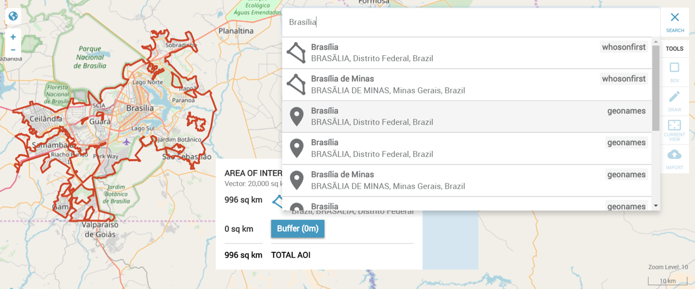
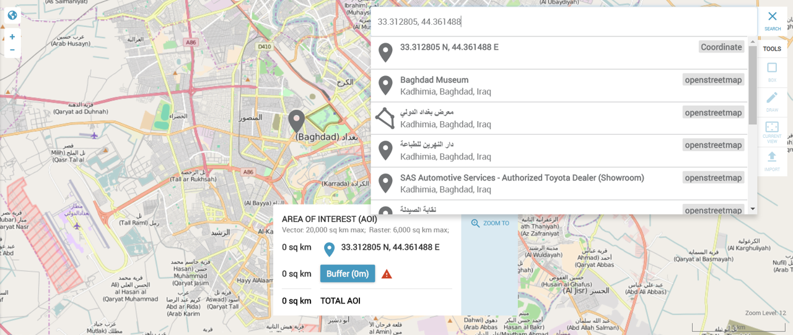
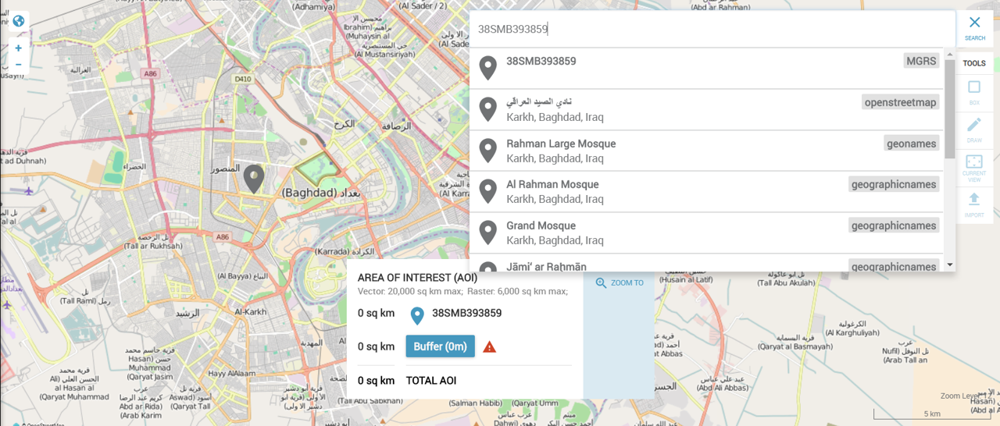

# Use of Pelias in Eventkit-Cloud 

Pelias is used in the Eventkit-Cloud application to allow users to search for locations and control the map. 

In EventKit all searches are passed from the front-end to the backend, which is why the examples here will be in Python 
using the Requests library.

## Search by name
The first interaction a user has with Pelias is searching for a location. Most commonly this is done with a Name that gets geocoded.

To do this a request is made to the [search endpoint](./search.md). 
```python
import requests
geojson = requests.get('http://your.pelias.test/v1/search', 
                       {'text': 'brasilia', 'geometries': 'point,polygon'}).json() 
```
We are passing in the users search entry "Brasilia", to the `/v1/search` endpoint.  
We are also requesting both points and polygons in the geojson response.   

In EventKit they want the polygon data to appear on the map.  Requesting polygon data for the search result will increase
the amount of time for the user to get a response because the data size takes longer to transfer. 

This is a preference.  This preference means that the exact search along with tons of geospatial polygon data is returned.  This allows EventKit not to make a second search for the polygon data after the user selects it. 

## Search by autocomplete
Another perhaps more common workflow would be to request only point data using the autocomplete endpoint.

```python
import requests
geojson = requests.get('http://your.pelias.test/v1/autocomplete', 
                       {'text': 'bras', 'geometries': 'point'}).json() 
```
This does two things different. 
 
 First, a list of results would be populated with what pelias most likely thinks the user wants for the search `bras`.
Which also returns Brasilia as the first result.  It also includes Brasov which is a very different result then above.  

The other difference is it is only point data which will return much faster. 

If after the user makes a selection you want to display the polygon data, you can make call to the place endpoint. 
```python
import requests
geojson = requests.get('http://your.pelias.test/v1/place', 
                       {'ids': 'whosonfirst:locality:101964877', 'geometries': 'polygon'}).json() 
```
Where ids is the global identification (gid) value of their selection (the first brasilia result). 
The result here would be the users selected feature as a geojson including polygon data.

## Search by latitude & longitude
A user may also want to search by decimal degree coordinates.  Pelias can't tell if a search is text or coordinates so your application
will need to determine that in advance, then the [reverse geocoding](./reverse.md) endpoint can be used.


```python
import requests
geojson = requests.get('http://your.pelias.test/v1/reverse', 
                       {'point.lat': '33.312805', 'point.lon': '44.361488'}).json() 
```
Here the result will be locations that are closest to those coordinates. 

## Search by MGRS
Additionally, if configured, the [convert endpoint](./convert.md) can be used to convert from or to Military Grid Reference System (MGRS) coordinates. 

```python
import requests
geojson = requests.get('http://your.pelias.test/v1/convert', 
                       {'from': 'mgrs', 'to': 'decdeg', 'q': '38SMB393859'}).json() 
```
Here the result will be a geojson for the given query.
```json
{
    "type": "Feature",
    "geometry": {
        "type": "Point",
        "coordinates": [44.34791, 33.31051]
        },
    "properties": {
    "name": "38SMB393859",
    "from": "mgrs",
    "to": "decdeg"
    }
}
```
The results can be used directly or in the case of EventKit the coodinates are then submitted to the reverse endpoint to also 
provide locations.

## Hierarchical lookup

One unique feature of Pelias is that it indexes all of the data in a parent child hierarchy.  This can be used for a vareity of purposes.
EventKit uses it to provide a better map experience.  When a user selects a feature it may not be obvious how far the map should zoom.   
If there is a bounding box then it can be fit in the window, but if it is missing a bounding box (like a building) an easy way is to set it to the size of the parent node. 
For example:
```python
import requests

def add_bbox(data, url='http://your.pelias.test/v1/place'):
    """
    data: a geojson dataset from pelias as a python dict. 
    """
    # the different gid levels that should be checked for a bbox
    ids = ['neighbourhood_gid', 'locality_gid', 'county_gid', 'region_gid', 'country_gid']
    search_id = ''
    for id in ids:
        gid = data.get(id, data.get('properties', None).get(id, None))
        # use the gid if it exists and its not gid of the data in question
        # (if it is the gid of the data then we should already have a bbox if its available at that level)
        if gid and gid != data.get('gid'):
            search_id = gid
            break
    
    if search_id:
        response = requests.get(url, params={'ids': search_id}).json()
        features = response.get('features', [])
        if len(features):
            feature = features[0]
            bbox = feature.get('bbox', None)
            if bbox:
                data['bbox'] = bbox
                data['properties']['bbox'] = bbox
    return data
```