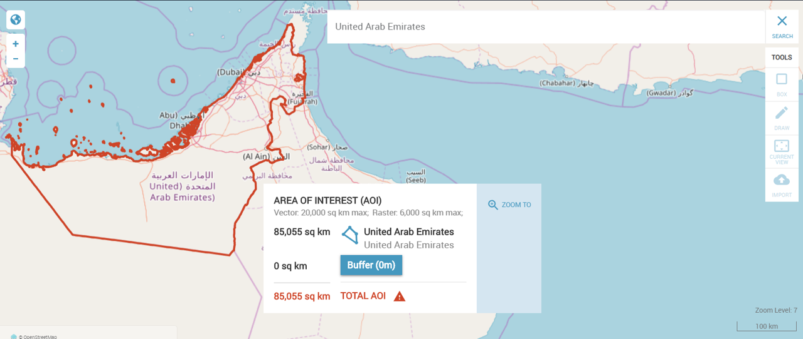

Pelias is an open-source [geocoder](glossary.md) for fast and accurate global search. It takes input text, such as the name of a place, point of interest, or address, and returns a latitude/longitude location on the Earth's surface for that place.

Pelias provides place and address search against several datasets, including NGA’s Geographic Names Database (GNDB), geonames.org, the Who’s On First (WOF) [gazetteer](glossary.md), OpenStreetMap, OpenAddresses, and administrative boundary (polygon) data to support search and filtering of results based on geometry types. 

---

# With Pelias you can:

## Search by name

## Search by MGRS

## Search by latitude & longitude

## Search using foreign characters

## Visualize your search

___**Images captured from [EventKit](https://github.com/venicegeo/eventkit-cloud), an opensource project utilizing Pelias.___