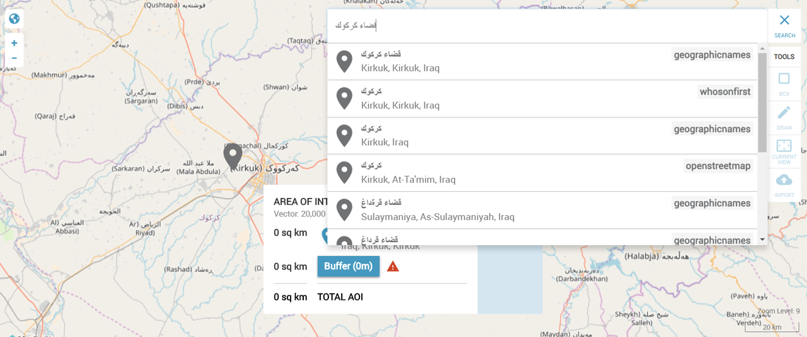

# Foreign language character sets

Pelias supports search with foreign language characters sets.



# Search by language code

You can get search results in another language, if available, by specifying a target language code with your request.

You can specify the target language code in the [BCP47 standard](http://www.rfc-editor.org/rfc/bcp/bcp47.txt) as either a query string URL parameter or an HTTP header.

BCP47 language tags can contain three parts:

   1. A language subtag (en, zh).
   2. A script subtag (Hant, Latn).
   3. A region subtag (US, CN).

At this time, only the `language subtag` information is used to set the target language. The other options may be enabled in the future when additional data can be imported with text containing `script subtag` and `region subtag` variants.

### Set language as a query string in the URL

You can specify the language code using a URL parameter named `lang`: 

> `v1/search?text=北京&lang=en`

> `v1/search?text=北京&lang=fr`

> `v1/search?text=beijing&lang=zh`

### Set language in the HTTP header

You can include the language code in the HTTP request header with the `Accept-Language` parameter: `Accept-Language: de-ch`.

## Language properties in the response

The response contains information about the language being returned, which can be helpful for debugging.  

```json
{
  "geocoding": {
      [...]
      "lang": {
        "name": "German",
        "iso6391": "de",
        "iso6393": "deu",
        "defaulted": false
      },
      [...]
    },
[...]
```

The language items include:

- `name`: a human-readable name for the language, in English
- `iso6391` and `iso6393`: the language code as defined in the two most common standards
- `defaulted`: a value of `true` or `false` to indicate if there was a fall-back to a default language property

If the language you requested is unavailable, then the default language is returned. In some cases, this is the local language, or it may be English for other datasets. Note that a language code in the query string takes precedence over a code in the header. If you include an invalid language code, then you see a warning message and the search attempts to find a valid code, if one is available. Otherwise, the results fall back to default behavior.
